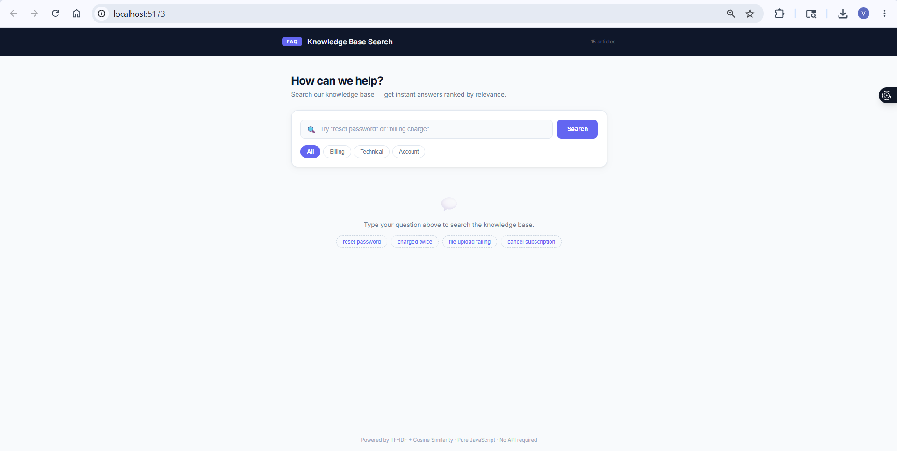
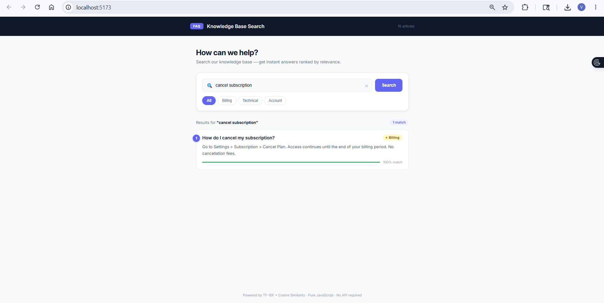
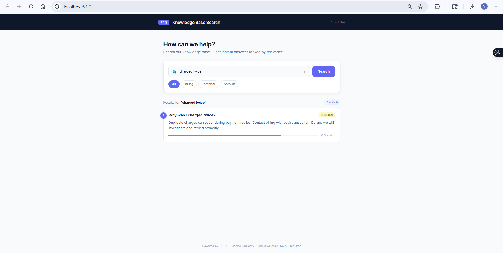
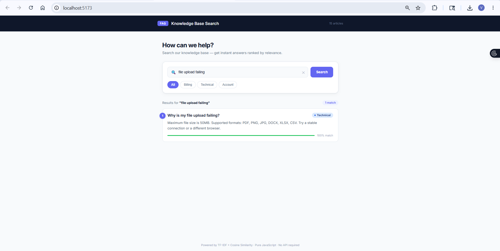
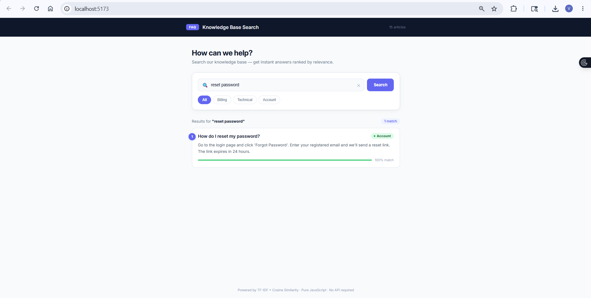

# FAQ Search

A single-page web application where users type a question and get up to 3 matching FAQ entries, ranked by relevance using TF-IDF + cosine similarity — all in-browser with no backend or paid APIs.

---

## Overview

This app lets users search a knowledge base by typing a natural-language question. It loads a local `faq.json` dataset (15 items across Billing, Technical, and Account categories), builds a TF-IDF index in memory at startup, and scores every FAQ against the user's query using cosine similarity. Results are ranked by relevance score and the top 3 are displayed. Users can also filter by category (Billing, Technical, Account) before searching.

---

## Screenshots

### Initial Page (before search)


### Search Results — "reset password"


### More Example Searches




---

## How to Run

**Prerequisites:** Node.js 20+ and npm

```bash
git clone <your-repo-url>
cd faq-search
npm install
npm run dev
```

Open [http://localhost:5173](http://localhost:5173) in your browser.

> Note: If you are on Node.js 21 or below, run `npm install vite@5 --save-dev` first, then `npm run dev`.

---

## How to Run Tests

```bash
npm test
```

Runs 16 unit tests covering `tokenize()`, `cosineSimilarity()`, and `search()` using Vitest. No browser or network connection required — all tests run in pure JavaScript (jsdom environment).

Expected output:
```
✓ src/searchEngine.test.js (16 tests)
Test Files  1 passed (1)
Tests       16 passed (16)
```

---

## Search Approach

**TF-IDF + Cosine Similarity** — implemented from scratch in pure JavaScript with no external libraries.

### How it works

1. **Tokenisation** — Each FAQ's `question + answer` text is lowercased, stripped of punctuation, split on whitespace, and filtered against a stop-word list (common words like "the", "is", "how" are removed). This leaves only meaningful terms.

2. **Term Frequency (TF)** — For each document, count how often each token appears, then normalise by document length. This prevents longer documents from being unfairly ranked higher.

3. **Inverse Document Frequency (IDF)** — Terms that appear in many documents are less useful for distinguishing relevance. IDF down-weights them using:
   ```
   IDF(t) = log((N + 1) / (df(t) + 1)) + 1
   ```
   where N = total documents, df(t) = number of documents containing term t. The smoothing (+1) avoids division by zero.

4. **TF-IDF Vector** — Each document and the query are represented as a sparse `{ term: weight }` map where `weight = TF x IDF`.

5. **Cosine Similarity** — The query vector is compared against every document vector:
   ```
   score = dot_product(query, doc) / (magnitude(query) x magnitude(doc))
   ```
   Score ranges from 0 (no overlap) to 1 (identical). Results below a 0.05 threshold are excluded to avoid irrelevant matches.

6. **Top 3** — Remaining results are sorted descending by score and sliced to 3.

### Why TF-IDF?

- Zero dependencies, runs entirely in the browser
- Fast enough for hundreds of FAQs with no perceptible delay
- Explainable and auditable — you can inspect every token weight
- Sufficient for keyword-based FAQ retrieval

---

## Sample Queries

| Query | Expected top result | Category |
|---|---|---|
| `reset password` | How do I reset my password? | Account |
| `charged twice` | Why was I charged twice? | Billing |
| `file upload failing` | Why is my file upload failing? | Technical |
| `cancel plan` | How do I cancel my subscription? | Billing |
| `app slow freezing` | The app is running slowly or freezing | Technical |

---

## Category Filter

Use the pill buttons — **All / Billing / Technical / Account** — to restrict results to a specific category before or after typing a query. Selecting a category re-runs the active search scoped to that category.

---

## Known Limitations

- **Keyword dependency** — TF-IDF requires token overlap between the query and documents. "Can't log in" will not match "account locked" even though they mean the same thing, because they share no tokens after stop-word removal.
- **No stemming or lemmatisation** — "billing" and "billed" are treated as different tokens. A stemmer (e.g. Porter Stemmer) would improve recall.
- **Small dataset** — IDF weighting is most effective at 100+ documents. With only 15 FAQs, many IDF values are similar.
- **No REST API** — Search runs directly in React. There is no POST `/api/search` endpoint.
- **No persistence** — The index is rebuilt from `faq.json` on every page load.
- **No multi-word phrase matching** — "two-factor authentication" is tokenised as two separate terms; phrase proximity is not considered.

---

## How I Would Upgrade to Embeddings / RAG

- **In-browser vector search**: I would Replace TF-IDF with sentence embeddings using [`@xenova/transformers`](https://github.com/xenova/transformers.js) and the `all-MiniLM-L6-v2` model (~25 MB, runs via WebAssembly). This handles semantic similarity — "can't log in" would correctly match "account locked" — with zero API cost and no backend.
- **Pre-computed embeddings**: Embed all FAQs at build time and ship the vectors as a static JSON file, so there is no startup cost on each page load.
- **Server-side RAG pipeline**: For larger datasets, store embeddings in **pgvector** (Postgres extension), expose a POST `/api/search` endpoint that retrieves top-K neighbours, and optionally pass the top results to an LLM to synthesise a direct answer rather than just listing FAQs.
- **Re-ranking**: Add a cross-encoder re-ranker as a second pass for higher precision on ambiguous queries.

---

## Project Structure

```
faq-search/
├── public/
│   └── faq.json                  # 15 FAQ items (Billing, Technical, Account)
├── src/
│   ├── searchEngine.js           # TF-IDF + cosine similarity (pure JS)
│   ├── searchEngine.test.js      # 16 unit tests (Vitest)
│   ├── App.jsx                   # React UI — search input, results, category filter
│   ├── App.css                   # Styles
│   └── main.jsx                  # React entry point
├── .github/
│   └── workflows/
│       └── ci.yml                # GitHub Actions — runs npm test on push
├── screenshots/                  # Screenshots for this README
├── vite.config.js                # Vite + Vitest config
├── package.json
└── README.md
```